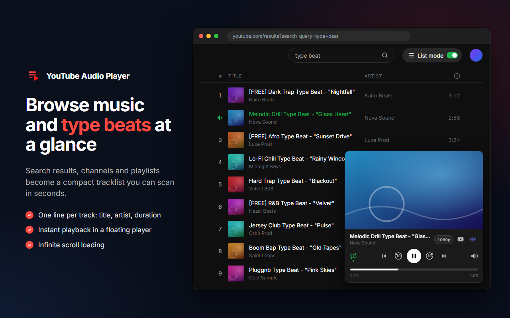

<div align="center">
  
  <h1>YouTube Audio Player</h1>
  <p>Browse music and type beats on YouTube as easily as in a streaming app.</p>

  [](LICENSE)
  [](https://developer.chrome.com/docs/extensions/develop/migrate/what-is-mv3)
  [](https://www.typescriptlang.org/)
  [](https://vitejs.dev/)
  [](https://ko-fi.com/youtubeaudioplayer)
</div>

---

**YouTube Audio Player** is a Chrome extension that turns YouTube search results, channel videos and playlists into a compact tracklist — one line per track — with a floating player, so you can dig through music and type beats without leaving the page.



## ✨ Features

- 🎧 **Tracklist view** — title, artist, duration, one line per track, with an animated waveform on the playing track
- 🔎 **Works everywhere you dig** — search results, channel *Videos* tab, playlists, Liked videos and Watch Later
- ♾️ **Infinite scroll** — powered by YouTube's own pagination
- ▶️ **Floating player** — play/pause, previous/next, draggable progress bar, ±10 s, repeat, vertical volume, video quality, auto-next, copy the video link
- 🎬 **Clean video** — the YouTube overlay is hidden, but the video and ads stay visible (skip button included)
- 🔀 **One-click toggle** — a *List mode* switch in the YouTube top bar (or the extension popup), synced across tabs
- 🎨 **Player themes** — Dark, Light or a mid-2000s *iTunes* look, picked from the extension popup (the YouTube interface itself is left untouched)
- ⌨️ **Keyboard shortcuts** — see below
- 🌍 **Localized** in English, French and Spanish
- 🔒 **Private** — no account, no analytics, no data leaves your browser ([privacy policy](PRIVACY.md))

### Keyboard shortcuts

| Key | Action |
|---|---|
| `Space` | Play / pause |
| `←` / `→` | Back / forward 10 seconds |
| `Shift` + `←` / `→` | Previous / next track |
| `R` | Repeat |
| `M` | Mute |
| `Alt` + `↑` / `↓` | Volume |

## 📦 Installation

### From the Chrome Web Store

Coming soon.

### From source

Requires [Node.js](https://nodejs.org/) 18 or later.

```bash
git clone https://github.com/HugoSohm/youtube-audio-player.git
cd youtube-audio-player
npm install
npm run build
```

Then in Chrome:

1. Open `chrome://extensions`
2. Enable **Developer mode** (top right)
3. Click **Load unpacked** and select the `dist/` folder

## 🛠️ Development

| Command | Description |
|---|---|
| `npm run dev` | Rebuild `dist/` on every change (then reload the extension in `chrome://extensions`) |
| `npm run build` | Build the extension into `dist/` |
| `npm run typecheck` | Type-check the project with TypeScript |
| `npm run package` | Production build without source maps + `release/youtube-audio-player-v<version>.zip` for the Chrome Web Store |
| `npm run store-assets` | Regenerate the icons and the Chrome Web Store visuals (requires Chrome installed) |
| `npm run promo-gif` | Render the animated promo GIF (`store-assets/out/promo-en.gif`, requires Chrome installed) |

### Project structure

```
manifest.json            Manifest V3 (built by @crxjs/vite-plugin)
src/
├── content.ts           Content script entry point: page detection, SPA navigation, mounting
├── extractor.ts         Reads tracks from the YouTube DOM (classic ytd-* and new yt-*-view-model components)
├── tracklist.ts         Tracklist rendering
├── player.ts            Floating player (hidden /watch iframe driven through its <video> element)
├── toggle.ts            "List mode" switch in the YouTube top bar
├── keyboard.ts          Keyboard shortcuts
├── popup.ts / popup.html  Toolbar popup: List mode switch, player theme
├── themes.ts            Player themes (styles in styles/themes.scss)
├── background.ts        Service worker: OFF badge, video quality
├── i18n.ts              chrome.i18n helper
├── types.ts             Shared types
└── styles/              SCSS
public/
├── _locales/            Translations (en, fr, es)
└── icons/               Extension icons
scripts/package.mjs      Chrome Web Store ZIP
store-assets/            Logo, store visuals generator, store descriptions
```

### How it works

- **Tracklist** — the extension hides YouTube's native video grid with CSS and renders its own list in its place. YouTube's *continuation* element is kept right below the list, so native infinite scroll keeps working.
- **Player** — YouTube refuses embeds on youtube.com itself (errors 152/153) and doesn't load its IFrame API there, so the player is a same-origin `/watch` iframe. The extension injects CSS to show only the video (and ads) and controls the native `<video>` element directly.
- **Video quality** — the YouTube player API only exists in the page's main world, so the service worker calls it with `chrome.scripting.executeScript` in the player frame.

YouTube changes its markup regularly: most breakages come from selectors in [`src/extractor.ts`](src/extractor.ts) and [`src/styles/tracklist.scss`](src/styles/tracklist.scss).

## 🤝 Contributing

Contributions are welcome! Please read [CONTRIBUTING.md](CONTRIBUTING.md) before opening an issue or a pull request.

## 📄 License

[GNU Affero General Public License v3.0 or later](LICENSE) © Hugo Sohm

YouTube Audio Player is an independent project, not affiliated with, endorsed or sponsored by YouTube or Google. YouTube is a trademark of Google LLC.
